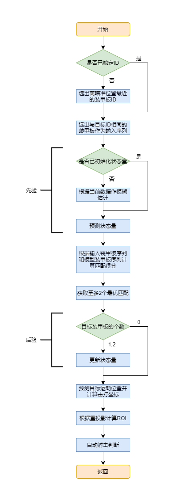

# WMJAimer 项目报告

[toc]

## 摘要

随着舵轮、全向轮底盘的盛行和各参赛队功率方案的不断优化，步兵和英雄小陀螺给予视觉自瞄的挑战越来越大。Aimer 模块是一种整车建模方案，旨在利用扩展卡尔曼滤波，通过对敌方车辆整体运动数据进行间接测量并建模的方式预测装甲板位置，进行更有效的击打。另外，通过基于熵权法的目标跟踪、基于重投影确定 ROI 等方法我们可以更好地锁定同一车辆并进行持续的观测，结合模型预测控制方法，云台跟随更加可靠且智能。由于该方案基于真实运动模型，对各种不同运动情况下的目标均有较好的预测效果，加之可以自动判断目标运动模式，对哨兵和容易忘记切换键位的操作手更加友好。

由于现如今基于扩展卡尔曼滤波和整车建模的反陀螺方案已经日趋成熟，本文介绍的方案相比于其他同类方案的优势主要体现在以下几个方面：

1. 加入基于熵权法的目标匹配降低了 yaw 观测跳变导致的模型异常抖动带来的影响；
2. 结合多目标观测数据，提高了建模的速度和精度；
3. 通过对噪声的细致分析降低了调参环节的复杂度；
4. 利用状态观测的重投影向识别模块返回更有参考性的 ROI；
5. 结合模型预测控制，达成更通用且精确的云台控制。

关键词：*反陀螺，整车建模，卡尔曼滤波，重投影，模型预测控制*

## 引言

### 需求分析

在已知当前和过去一段时间目标装甲板坐标信息的条件下，为了使我方发射的小弹丸能够在飞行时间过后击中目标装甲板，我们必须提前预测其未来将可能出现的位置。对于水平直线移动中的目标，我们可以将其近似为为匀速直线运动（CV模型）或匀加速直线运动（CA模型），通过卡尔曼滤波（Kalman Filtering，KF）估计其运动学参数，我们称之为“线性预测”。该方案在过往的大量研究和测试中已充分显示出其卓越性，在 RM 视觉算法中早已广为人知。

但是对于高速小陀螺旋转中的目标，如果将其近似为直线运动，预测的坐标位置很容易超出目标实际运动范围；且由于目标的频繁切换，KF 估计结果尚不精确的初始化阶段占据大部分时间，导致数据实际可信的区间较小，我们称之为发射窗口较小。而这正是小陀螺能够有效规避自瞄攻击的核心原理。

为了有效地对小陀螺旋转中的目标进行自瞄击打，我们需要针对对其旋转运动模式重新进行建模。更进一步地，如果能将其与一般的水平直线运动结合起来，我们还可以对边陀螺边移动的目标进行攻击，我们将其称之为动态陀螺，与之相对的原地陀螺模式我们称之为静态陀螺。在这个问题中我们可以大致根据重要性等级列出如下需求等级：

1. 预测静态陀螺的装甲板坐标；
2. 自动判断发射窗口，并应当尽可能占更大的时间比例；
3. 在目标切换的时候预测位置有良好的的衔接；
4. 对目标整体运动有一定判断，可预测多块装甲板坐标；
5. 预测动态陀螺的装甲板坐标；
6. 在存在掩体遮挡导致间歇性丢失识别的情况下仍能保持对目标的持续跟踪；
7. 对多个动态的完整目标进行跟踪；

这个应用问题实际上属于目标跟踪的研究范畴。但是一般的目标跟踪问题并不会特别关注预测方面，这意味着大量目标跟踪算法的数据有效性仅停留在坐标维度，在速度乃至加速度维度的跟踪结果并不稳定。

### 方案分析

之前针对小陀螺的自瞄算法主要分为以下几种：

1. 线性预测
2. 单周期建模
3. 整车建模

线性预测即传统的线性卡尔曼滤波和预测方法，也是我们曾经采用过的一种方案。它的好处在于观测量直接，可以描述三维坐标下的匀加速运动，对各种复杂情况都有较好的适应性，且调参相对简单。但是其根本弱点在于，卡尔曼线性预测只能针对单一装甲板目标，而当目标处于小陀螺旋转时，不能很好地应对目标的快速切换。当新的目标出现时，卡尔曼滤波将被完全或部分重置，永远不能提前判断即将出现的新目标。另一个方面的表现是，当目标运动过快时，预测位置很容易出现在一个装甲板根本不会出现的位置，即车身整体之外，此时自瞄将彻底失去意义。线性预测的优化方案是在目标切换时选择性地保留一部分状态量数据，即对新的目标运动不从初始化开始重新估计，而是在上一个目标运动的基础上继续估计，虽然效果得到了一定提升，但是调参非常痛苦。

单周期建模是指将单个装甲板出现的一段时间称为一个周期，对每个周期单独建模，对该周期或下一个周期的装甲板作出预测击打。这个过程中可以保留一部分的建模数据，是针对慢速陀螺比较稳定的一种方法。但是快速旋转时由于单个周期的数据量过小，建模容易出现误差；而且控制和发射方面的逻辑并不好做，击发窗口较小，无法进行快速打击。

整车建模是指对敌方车辆的整体运动参数进行估计的一种方法，理论上可以完全还原和预测车辆运动行为。2022 年 5 月上海交通大学曾经在 Bilibili 发布了一个视频，展示了从定点击打到整车建模迭代多个版本的反陀螺方案，最后一版的测试效果中很明显可以看到上交对目标四块装甲板的数据均有记录，且拥有非常稳定的命中效果。23 赛季中期，华南师范大学开源了一版简单但完备的整车建模方案，从此开始，反陀螺技术已然有成为自瞄标配的趋势。

本文中将要介绍的方案属于整车建模的一种，前提技术要求包括装甲板识别、坐标与姿态解算等，可以通过扩展卡尔曼滤波间接估计目标车辆整车运动模式并对其行为进行合理预测，选择最优的目标装甲板进行击打，并综合了目标匹配和重投影算法提高其鲁棒性。

## 状态观测

### 卡尔曼滤波

卡尔曼滤波是一种利用线性系统状态方程，通过系统输入输出观测数据，对系统状态进行最优估计的算法。由于观测数据中包括系统中的噪声和干扰的影响，所以最优估计也可看作是滤波过程。

数据滤波是去除噪声还原真实数据的一种数据处理技术，卡尔曼滤波在测量方差已知的情况下能够从一系列存在测量噪声的数据中，估计动态系统的状态。由于它便于计算机编程实现，并能够对现场采集的数据进行实时的更新和处理，卡尔曼滤波是目前应用最为广泛的滤波方法，在通信、导航、制导与控制等多领域得到了较好的应用。它还具有占用内存小的优点（除了前一个状态量外，不需要保留其它历史数据），并且速度很快，很适合应用于实时问题和嵌入式系统。

我们先来描述线性系统，一个线性系统的状态转移方程可以用如下方程表示

$$
\begin{align}
x_k &= A x_{k-1} + B u_{k-1} + w_{k-1} \tag{1.1} \\
z_k &= H x_{k} + v_k \tag{1.2}
\end{align}
$$

其中 $x_k$ 表示 k 时刻的状态量， $u_{k-1}$ 表示外部控制量， $w_{k-1}$ 表示系统误差， $A$ 和 $B$ 联合表示状态转移矩阵； $z_k$ 表示观测量， $H$ 表示观测矩阵， $v_k$ 表示测量误差。一般的线性系统中假设所有误差均服从高斯分布，即 $P(w) \sim N(0,Q), P(v) \sim N(0,R)$ ，其中 $Q$ 表示系统噪声， $R$ 表示观测噪声，他们是系统的固有属性。

卡尔曼滤波的过程分为两步：预测和校正，或称先验和后验。

在预测过程中，直接根据状态转移方程严格更新状态量 $x$ 和状态协方差矩阵 $P$ ，计算出来的结果称为先验。

$$
\begin{align}
\hat{x}_k^- &= A\hat{x}_{k-1} + B u_{k-1} \tag{1.3} \\
P_k^- &= A P_{k-1} A^T + Q \tag{1.4}
\end{align}
$$

在校正过程中，权重矩阵 $K$ 将根据系统噪声和观测噪声的相对大小，调节对系统状态转移和观测输入两者的置信度。道理非常简单：如果系统噪声更大， $K$ 选择更相信观测；如果观测噪声更大， $K$ 则选择更相信系统状态转移。通过 $K$ 校正的结果称为后验，即卡尔曼滤波器的最终输出。

$$
\begin{align}
K_k &= \frac{P_k^- H^T}{H P_k^- H^T + R} \tag{1.5} \\
\hat{x_k} &= \hat{x}_k^- + K_k(z_k - H \hat{x}_k^-) \tag{1.6} \\
P_k &= (I - K_k H)P_k^- \tag{1.7}
\end{align}
$$

$(1.3)-(1.7)$ 式即为卡尔曼滤波的核心公式。

### 扩展卡尔曼

为了满足更深的需要，若目标系统为非线性系统，需要对卡尔曼滤波的公式做出一定修改，从而提出了扩展卡尔曼（Extended Kalman Filtering，简称 EKF）。非线性系统无法用矩阵形式描述，我们用如下方法简单表示

$$
\begin{align}
x_k &= f(x_{k-1}, u_{k-1}, w_{k-1}) \tag{2.1} \\
z_k &= h(x_k, v_k) \tag{2.2}
\end{align}
$$

其中 $f, h$ 为两个非线性方程。原始误差仍服从高斯分布，但是通过非线性方程的映射后误差将不再服从高斯分布，这也是此时必须要修改卡尔曼滤波公式的原因。扩展卡尔曼通过一阶线性化解决该问题，将 $f(x_k)$ 在 $\hat{x}_{k-1}$ 处线性化后，非线性系统可表示为

$$
\begin{align}
x_k &= f(\hat{x}_{k-1}, u_{k-1}, 0) + A(x_k - \hat{x}_{k-1}) + W w_{k-1} \\
	&= \tilde{x}_k
		+ \frac{\partial f}{\partial x}|_{\hat{x}_{k-1}, u_{k-1}} (x_k - \hat{x}_{k-1})
		+ \frac{\partial f}{\partial w}|_{\hat{x}_{k-1}, u_{k-1}} w_{k-1} \\
z_k &= h(\tilde{x}_k, 0) + H(x_k - \tilde{x}_k) + V v_k \\
	&= \tilde{z}_k
		+ \frac{\partial h}{\partial x}|_{\tilde{x}_k} (x_k - \tilde{x}_k)
		+ \frac{\partial h}{\partial v}|_{\tilde{x}_k} v_k
\end{align}
$$

注意 $P(W w) \sim N(0,W Q W^T), P(V v) \sim N(0,V R V^T)$ 。

从而，预测和校正过程的公式也同样做出修改，如下所示

$$
\begin{align}
\hat{x}_k^- &= f(\hat{x}_{k-1}, u_{k-1}, 0) \tag{2.3} \\
P_k^- &= A P_{K-1} A^T + W Q W^T \tag{2.4} \\
K_k &= \frac{P_k^- H^T}{H P_k^- H^T + V R V^T} \tag{2.5} \\
\hat{x}_k &= \hat{x}_k^- + K_k(z_k - h(\hat{x}_k^-, 0)) \tag{2.6} \\
P_k &= (I - K_k H)_k^- \tag{2.7}
\end{align}
$$

其中 $A, W, H, V$ 均为偏导矩阵。 $(2.3)-(2.7)$ 式即为扩展卡尔曼滤波的核心公式。

## 整车建模

整个建模过程的核心内容如下图所示：

首先，第一次获取识别到的装甲板坐标队列时，我们根据*与当前枪口指向的位姿差*选取操作手最有可能想要瞄准的目标，并锁定该装甲板的ID，在不重置该模块的情况下后续将只针对同 ID 的装甲板进行处理。

其次，根据上一帧得到的状态量计算先验状态量；若上一阵无状态量，即当前为第一次获取数据，以当前队列首个装甲板坐标近似计算状态量的初始值。在此之后，我们将当前先验状态下四个装甲板的队列和经过 ID 筛选的识别到的装甲板队列进行匹配，获得至多 2 个最优匹配，并将其作为观测量更新先验状态量；若匹配结果为空，则不进行后验更新。

获得状态估计之后，我们根据目标离自身的距离计算子弹飞行时间，并预测该时间后最优的攻击目标，我们设定为彼时距己最近的装甲板。最后根据当前状态估计的五个关键点计算重投影向识别模块返回 ROI 参数。

### 模型构建

基于卡尔曼滤波的原理，我们设计了一套整车建模的数据模型，它可以根据观测量去间接推算目标整体的运动状态量。注意，以下所有讨论基于绝对坐标系进行。

我们规定状态量如下包含如下内容：

1. 中心点 X 轴坐标 $x_c$
2. 中心点 Y 轴坐标 $y_c$
3. 中心点 X 轴速度 $v_x$
4. 中心点 Y 轴速度 $v_y$
5. 第一组装甲板 Z 轴坐标 $z_0$
6. 第二组装甲板 Z 轴坐标 $z_1$
7. 第一组装甲板半径 $r_0$
8. 第二组装甲板半径 $r_1$
9. 0 号装甲板的角度 $\phi$
10. 角速度 $\omega$

在此特别说明一下关于 0 号装甲板，我们将其定义为模型初始化时输入的第一块装甲板。为使角度计算通用，我们令所有的四块装甲板角度范围均为 $[-\infin, +\infin)$ ，为此我们设计了一个宏定义函数 `_std_radian` 在 KF 的更新过程内使观测量中范围为 $(-\pi, \pi)$ 的角度与其同步。

观测量包含的内容则相对较少：

1. 装甲板 X 轴坐标 $x_0$
2. 装甲板 Y 轴坐标 $y_0$
3. 装甲板 Z 轴坐标 $z_0$
4. 装甲板角度 $\alpha_0$

但是当角度合适时，我们很容易同时观测到同一单位的两块装甲板出现在视野中，实际上这种情况出现的概率并不算很小。在这种时候，我们可以把我们的观测量扩张一倍，在卡尔曼滤波的计算过程中需要将与观测量相关的矩阵均扩张至 8 维，包括测量噪声矩阵（实际上我们在初始化的时候定义了两个相同参数不同大小的测量噪声矩阵）。整个系统可以用如下方程描述

$$
\begin{align}
\begin{pmatrix}
    x_{c,k} \\
    y_{c,k} \\
    v_{x,k} \\
    v_{y,k} \\
    z_{0,k} \\
    z_{1,k} \\
    r_{0,k} \\
    r_{1,k} \\
    \phi_k \\
    \omega_k
\end{pmatrix}
&=
\hat{x}_k
= A \hat{x}_{k-1} =
\begin{pmatrix}
    1 & 0 & \Delta t & 0 & 0 & 0 & 0 & 0 & 0 & 0 \\
    0 & 1 & 0 & \Delta t & 0 & 0 & 0 & 0 & 0 & 0 \\
    0 & 0 & 1 & 0 & 0 & 0 & 0 & 0 & 0 & 0 \\
    0 & 0 & 0 & 1 & 0 & 0 & 0 & 0 & 0 & 0 \\
    0 & 0 & 0 & 0 & 1 & 0 & 0 & 0 & 0 & 0 \\
    0 & 0 & 0 & 0 & 0 & 1 & 0 & 0 & 0 & 0 \\
    0 & 0 & 0 & 0 & 0 & 0 & 1 & 0 & 0 & 0 \\
    0 & 0 & 0 & 0 & 0 & 0 & 0 & 1 & 0 & 0 \\
    0 & 0 & 0 & 0 & 0 & 0 & 0 & 0 & 1 & \Delta t \\
    0 & 0 & 0 & 0 & 0 & 0 & 0 & 0 & 0 & 1
\end{pmatrix}
\begin{pmatrix}
    x_{c,k-1} \\
    y_{c,k-1} \\
    v_{x,k-1} \\
    v_{y,k-1} \\
    z_{0,k-1} \\
    z_{1,k-1} \\
    r_{0,k-1} \\
    r_{1,k-1} \\
    \phi_{k-1} \\
    \omega_{k-1}
\end{pmatrix}
\tag{3.1}
\\
\begin{pmatrix}
    x_{0,k} \\
    y_{0,k} \\
    z_{0,k} \\
    \alpha_{0,k}
\end{pmatrix}
&= z_k
= h^{(i)}(\hat{x}_k, 0) =
\begin{cases}
	x_{c,k} + r_{j} \cos(\phi + \frac{\pi i}{2}) \\
	y_{c,k} + r_{j} \sin(\phi + \frac{\pi i}{2}) \\
	z_{j,k} \\
	\phi + \frac{\pi i}{2}
\end{cases},
j = i - 2[\frac{i}{2}],
i \in \{0, 1, 2, 3\}
\tag{3.2}
\end{align}
$$

可以发现实际上只有观测方程为非线性方程。

关于状态转移噪声的设定，我们查到两种不同的方案

> 由于时间久远，笔者已经找不到这两种方法的出处了，只在笔记上找到其简称分别是 DDM 和 DCM，若有人找到这两种方法的出处，欢迎联系我们修正此处内容。

1. DDM

假定噪声离散，通过统计学方法计算坐标与其微分和二阶微分的噪声分布关系，例如在一个 CV 模型中，令 $D(\ddot{x}) = \sigma$ ，有

$$
\begin{align}
D(x) &= D(\frac12 \ddot{x} \Delta t^2) = \frac14 \Delta t^4 D(\ddot{x}) = \frac14 \Delta t^4 \sigma \\
D(\dot{x}) &= D(\ddot{x} \Delta t) = \Delta t^2 D(\ddot{x}) = \Delta t^2 \sigma \\
\text{cov}(x, \dot{x}) &= \sqrt{D(x) D(\dot{x})} = \frac12 \Delta t^3 \sigma
\end{align}
$$

从而可得

$$
Q =
\begin{pmatrix}
D(x) & \text{cov}(x, \dot{x}) \\
\text{cov}(\dot{x}, x) & D(\dot{x})
\end{pmatrix} =
\begin{pmatrix}
\frac14 \Delta t^4 & \frac12 \Delta t^3 \\
\frac12 \Delta t^3 & \Delta t^2
\end{pmatrix} \sigma
$$

2. DCM

假设噪声连续，通过积分计算坐标与其微分的噪声分布关系，例如在一个 CV 模型中，有

$$
\begin{align}
Q &= \int\limits_{0}^{\Delta t} e^{A\tau} Q(\sigma) e^{A^T\tau} \, d\tau \\
&= \int\limits_{0}^{\Delta t}
\begin{pmatrix}
1 & \tau \\
0 & 1
\end{pmatrix}
\begin{pmatrix}
0 & 0 \\
0 & \sigma
\end{pmatrix}
\begin{pmatrix}
1 & 0 \\
\tau & 1
\end{pmatrix}
\, d\tau \\
&=
\begin{pmatrix}
\frac13 \Delta t^3 & \frac12 \Delta t^2 \\
\frac12 \Delta t^2 & \Delta t
\end{pmatrix} \sigma
\end{align}
$$

其中矩阵的指数运算 $e^M = \sum\limits_{k=0}^{+\infin} \frac1{k!}M^k$ 。

这两种方法在数量级上具有一定的差距，预设状态转移噪声的目的主要是为了简化调参流程并使其具有一定指导性，若拥有充分的设计经验，此处完全手动指定参数亦可。

此外，我们假定观测噪声在球坐标系下呈正态分布，设定噪声偏导矩阵如下

$$
V = 
\begin{pmatrix}
-d \cos(\phi) \sin(\psi) & -d \sin(\phi) \cos(\psi) & \cos(\phi) \cos(\psi) & 0 \\
 d \cos(\phi) \cos(\psi) & -d \sin(\phi) \sin(\psi) & \cos(\phi) \sin(\psi) & 0 \\
                       0 &  d \cos(\phi)            & \sin(\phi)            & 0 \\
                       0 &                        0 &                     0 & 1
\end{pmatrix}
$$

其中 $d, \phi, \psi$ 分别表示距离、俯仰角和偏航角。

### 目标匹配

根据局部还原整体还有一个问题需要解决，那就是如何确定每一块装甲板到底是目标上的哪一块。这将直接决定我们对目标整体状态估计的有效性，否则目标的运动将非常容易呈现出混乱的状态，最直观的表现就是状态量大幅度的跳变。Aimer 采用了熵权法来估计真实装甲板和模型装甲板之间的相似度，以解决目标匹配问题。熵权法是一种客观赋权方法，根据各指标的数据的分散程度，利用信息熵计算出各指标的熵权，再根据各指标对熵权进行一定的修正，从而得到较为客观的指标权重。在这里我们以“输入序列的装甲板数据”与“模型的四个标准装甲板数据”之差作为输入量，两个负向指标分别为装甲板的空间距离和角度差，目的是得出两个指标的权重并最终得出装甲板之间的相关性矩阵，或称匹配代价矩阵。

设输入装甲板序列长度为 $q$ ，我们一共能获得 $4q$ 个样本指标向量 $r_{4a+b,*}^{'}$ ，其中 $a \in \{0, 1, \dots, q-1\}, b \in \{0, 1, 2, 3\}$ 。

$$
r_{4a+b,*}^{'} =
\begin{pmatrix}
    \sqrt{(x_a - x_b)^2 + (y_a - y_b)^2 + (z_a - z_b)^2} \\
    |\alpha_a - \alpha_b|
\end{pmatrix}^T
\tag{4.1}
$$

以下是熵权法的公式。

首先计算标准化指标 $R$

$$
r_{ij} =
\begin{cases}
    \frac{r_{i,j}^{'} - \min\limits_{i} r_{i,j}^{'}}{\max\limits_{i} r_{i,j}^{'} - \min\limits_{i} r_{i,j}^{'}}, \text{j为正指标} \\
    \frac{\max\limits_{i} r_{i,j}^{'} - r_{i,j}^{'}}{\max\limits_{i} r_{i,j}^{'} - \min\limits_{i} r_{i,j}^{'}}, \text{j为负指标}
\end{cases}
\tag{4.2}
$$

计算样本值占指标的比重 $P$

$$
p_{i,j} = \frac{r_{i,j}}{\sum\limits_{i=1}^{m} r_{i,j}} \tag{4.3}
$$

计算每个指标的熵值 $H$

$$
H_j = -\frac{1}{\ln{m}} \sum\limits_{i=1}^{m} p_{i,j} \ln{p_{i,j}} \tag{4.4}
$$

计算每个指标的熵权 $w$

$$
w_j = \frac{1 - H_j}{\sum\limits_{j=1}^{n} (1 - H_j)} = \frac{1 - H_j}{n - \sum\limits_{j=1}^{n} H_j} \tag{4.5}
$$

最终获得每个样本的综合指标 $S$

$$
S_i = \sum\limits_{j=1}^{m} w_j r_{i,j}^{'} \tag{4.6}
$$

最后我们通过暴力枚举取得至多两个最优且不冲突的匹配（因为理论上同时至多只能看到来自同一辆车的两块装甲板），更好的方法是通过 KM 算法进行匹配。

> 但是由于太菜了没有写出来。

### 重投影

重投影指的是将三维坐标系下的点投射回相机平面上的过程，运用重投影的方法构造 ROI 的目的是为了更好的跟踪整车运动而识别到尽可能多的装甲板。

重投影的过程直接根据相机成像的坐标变换公式即可获得

$$
Z_c
\begin{pmatrix}
u \\ v \\ 1
\end{pmatrix} =
\begin{pmatrix}
f_x & s & x_0 & 0 \\
0 & f_y & y_0 & 0 \\
0 & 0 & 1 & 0
\end{pmatrix}
\begin{pmatrix}
X_c\\ Y_c \\ Z_c \\ 1
\end{pmatrix} =
\begin{pmatrix}
f_x & s & x_0 & 0 \\
0 & f_y & y_0 & 0 \\
0 & 0 & 1 & 0
\end{pmatrix}
\begin{pmatrix}
R_{3 \times 3} & t_{3 \times 1} \\
\vec{0} & 1
\end{pmatrix}
\begin{pmatrix}
X_w \\ Y_w \\ Z_w \\ 1
\end{pmatrix}
$$

其中角标 c 表示相机系，角标 w 表示世界系。根据车体中心和四块装甲板的三维坐标即可反推得到它们在相机平面上的像素坐标，从而获得一个最为合理的 ROI 估计。注意左右目和深度学习的 ROI 应区分考虑，另外，在我们的代码中坐标系的定义与此处 OpenCV 的默认定义并不相同。

## 模型预测控制

MPC 的具体原理可见另一篇 [MPC 开源](https://github.com/SnocrashWang/MPC/)。

> 强烈推荐学习 DR_CAN 的视频，或《控制之美》系列。

在云台的控制问题中我们简单的设状态量为云台的俯仰角和偏航角，控制量为俯仰角和偏航角的速度，状态空间方程如下所示

$$
\begin{pmatrix}
p_{k+1} \\
y_{k+1}
\end{pmatrix} =
\begin{pmatrix}
1 & 0 \\
0 & 1
\end{pmatrix}
\begin{pmatrix}
p_k \\
y_k
\end{pmatrix} +
\begin{pmatrix}
\Delta t & 0 \\
0 & \Delta t
\end{pmatrix}
\begin{pmatrix}
v_{p,k} \\
y_{y,k}
\end{pmatrix}
$$

---

## 研发迭代过程

| 版本 | 主题               | 主要变更                                                     | 测试效果                                                     | 完成时间   | 备注                    |
| ---- | ------------------ | ------------------------------------------------------------ | ------------------------------------------------------------ | ---------- | ----------------------- |
| V0.1 | 平面单目标估计仿真 | 仿真测试，给予平面动态陀螺模式的单目标含噪观测量，通过 EKF 完成状态估计。 | 大约能在四分之三圆周后较为准确地估计旋转中心位置，效果良好。 | 2022.7.28  |                         |
| V0.2 | 平面多目标估计仿真 | 仿真测试，给予不定数目的多目标观测量。                       | 能够在 10 帧以内完成运动状态估计初始化； 参数未经细调，对运动状态变化的适应能力一般。 | 2022.7.30  |                         |
| V0.3 | 多目标估计数据测试 | 使用实录装甲板数据进行测试。 加入z轴； 加入击打目标筛选逻辑。 | 状态估计效果良好，能够适应不同的装甲板高度和旋转半径； 部分偏角较大的装甲板由于测距误差会周期性地对整体模型造成短暂影响。 | 2022.7.31  |                         |
| V1.0 | Alpha 测试         | 编写了第一版基本功能完整的 EKFAimer 模块； 制作了函数接口和调试程序，可以录制观测量数据并进行可视化测试。 加入 ID 锁； 加入熵权法的匹配权值； 加入暴力法的目标匹配； 加入简单的 ROI 反馈。 | 状态估计效果良好，能够适应不同的装甲板高度和旋转半径； 能够将未来距离自己最近的装甲板作为击打目标。 | 2022.7.31  |                         |
| V1.1 | Beta 测试          | 加入发射窗口判断； 加入异常数据处理。 优化目标筛选逻辑； 优化双目识别适配。 | 在单目步兵、双目步兵、英雄、（旧版）哨兵上均进行了测试，基本适应一般使用需求，能够对真实场景中的动态陀螺进行有效估计与攻击。 | 2022.8.1   |                         |
| V1.2 | EKFAimer 模块      | 作为独立模式加入状态机。 加入重投影计算的 ROI 反馈。 优化了面向哨兵使用的控制逻辑。 | 在实战对抗中表现出显著优于线性预测的反陀螺效果，适用于多种场景和运动模式。 由于模型中不含加速度分量，当目标急刹车时有较为明显的一段超前预测，尤其是面对（旧版）哨兵的快速折返运动时。 | 2022.8.3   | 22 赛季复活赛拟上场版本 |
| V1.3 | Aimer 通用模块     | 将 Aimer 作为唯一的反陀螺算法和状态机首选的预测器，更新了模块说明手册。 | 最好测试结果对麦轮步兵 40~80W 小陀螺有 95% 以上的命中率，且发射窗口几乎覆盖全时段；对 120W 小陀螺仍能命中。 | 2022.10.4  | 23 赛季联盟赛上场版本   |
| V2.0 | Singer 模型测试    | 尝试使用 Singer 模型替换匀速运动模型。                       | 效果不佳，参数极难调节。                                     | 2022.10.13 |                         |
| V2.1 | CA 模型测试        | 尝试使用匀加速运动模型替换匀速运动模型，将状态量扩展至 13 维。 | 在运动状态变化时的响应效果优化程度一般，更容易受噪声干扰。放弃 | 2022.11.28 |                         |
| V2.2 | UKF 测试           | 使用 UKF 代替 EKF，提供更高精度的非线性拟合效果。            | 数据测试不通过，待研。                                       | /          |                         |
| V3.0 | IMM 模型融合测试   | 尝试使用交互式多模型融合不同参数的 CA 模型和 CV 模型以应对不同运动状态之间的切换问题。 | 效果甚微。实验发现由于观测融合时存在两种不同维度的观测矩阵，模型融合时的置信度计算存在两种尺度。放弃。 | 2022.11.21 |                         |
| V3.1 | IMM 任务融合测试   | 为交互式多模型设计陀螺、前哨站、平衡陀螺三种运动模型融合。   | 效果不佳。认为原因同上。放弃。                               | /          |                         |
| V4.0 | 模块重构           | 将 EKF 与运动模型设为两种基类，增强代码的可扩展性。可根据识别情况自动区分模型种类，如标准陀螺、前哨站和平衡陀螺。 加入高速陀螺时定点击打中心的策略，降低云台响应带来的滞后影响，优化操作手体验； 优化状态转移噪声和观测噪声矩阵的构造方式。 | 已通过压力测试。                                             | 2023.4.30  | 23 赛季分区赛上场版本   |
| V4.1 | MPC 控制           | 使用 MPC 代替 PID 进行云台控制解算，以优化在目标切换和直线运动时的跟随效果。 | 仿真测试良好，实车测试通过，未经压力测试。                   | 2023.6.25  |                         |

注：我队步兵自瞄一直采用低射速进行测试，上述测试结果包括步兵 15m/s 射速、英雄 16m/s 射速和哨兵 30m/s 射速，所有上场版本均已在各种战况下得到可靠的测试结果。

## 遗留问题

1. yaw 角度跳变问题

   在特定情况下，根据 solvePnP 和 BA 优化得出的 yaw 角度均可能存在无规律的跳变。在经过了长达两年的各种测试与探索后，我们认为该问题目前尚未有传统意义上的合理解决办法。目前我们仍采用 solvePnP 的直接结果，优化方法为 `AP3P`。

2. 重投影算法

   目前的重投影部分代码从旧版的筛选器修改而成，耦合度过高，甚至有些地方依然保留了不精准的计算过程。

---

## 推荐阅读资料

[卡尔曼滤波器，DR_CAN，Bilibili](https://www.bilibili.com/video/BV1ez4y1X7eR/?spm_id_from=333.788&vd_source=9d4b3ad031f43830dad4944d85c1384f)

[模型预测控制器，DR_CAN，Bilibili](https://www.bilibili.com/video/BV1cL411n7KV/?share_source=copy_web&vd_source=1f484e59e99ed29fdece5126993aa064)

[熵权法求权重，一叶障目，知乎](https://www.zhihu.com/question/357680646/answer/943628631)

## 特别致谢

由衷感谢上海交通大学短暂公开的那个视频，西安交通大学、西安电子科技大学以及哈尔滨工程大学同学们和我们的交流分享，我们汲取了他们的宝贵经验。

---

&copy; 2023 NWPU WMJ Vision Group

